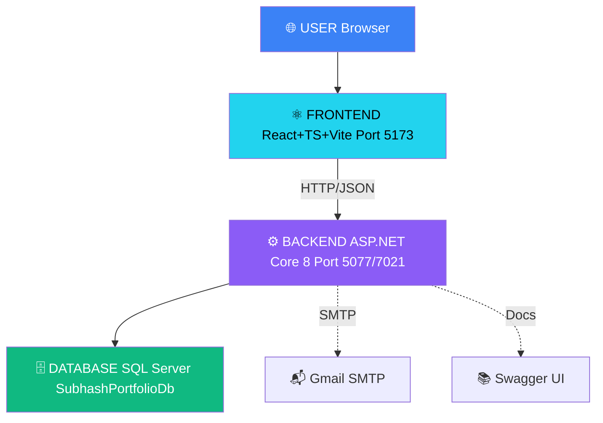

<!-- ════════════════════════════════════════════════════════════════════ -->
<!--                        🚀 PREMIUM HERO BANNER                       -->
<!-- ════════════════════════════════════════════════════════════════════ -->

<div align="center">


<!-- Typing SVG -->
<a href="https://github.com/subhash-dotnet-dev">
  
</a>

<br/><br/>

<!-- ═══════════════════ SOCIAL LINKS ═══════════════════ -->
<p>
  <a href="https://github.com/subhash-dotnet-dev">
    
  </a>
  <a href="https://www.linkedin.com/in/subhash-dotnet-dev/">
    
  </a>
  <a href="https://leetcode.com/subhashyadav">
    
  </a>
  <a href="https://www.hackerrank.com/profile/subhash_dev">
    
  </a>
  <a href="https://wa.me/919572003492">
    
  </a>
  <a href="mailto:subhash.dev79@gmail.com">
    
  </a>
</p>

<!-- ═══════════════════ PROFILE STATS ═══════════════════ -->
<p>
  
  
  
  
</p>

<!-- ═══════════════════ STATUS BADGES ═══════════════════ -->
<p>
  
  
  
  
</p>

<br/>

<!-- ═══════════════════ QUICK NAVIGATION ═══════════════════ -->
<h3>📌 Quick Navigation</h3>

<p>
  <a href="#-about-the-project"></a>
  <a href="#-tech-stack"></a>
  <a href="#-features"></a>
  <a href="#-architecture"></a>
  <a href="#-api-endpoints"></a>
  <a href="#-getting-started"></a>
  <a href="#-contact"></a>
</p>

<br/>


</div>

<br/>

<!-- ════════════════════════════════════════════════════════════════════ -->
<!--                        🎯 ABOUT THE PROJECT                         -->
<!-- ════════════════════════════════════════════════════════════════════ -->

<h2 id="-about-the-project">
  
  About The Project
</h2>

<div align="center">

> 🎨 **A modern, production-ready portfolio** — crafted with **React 18 + TypeScript** on the frontend and **ASP.NET Core 8 Web API** on the backend, following **Clean Architecture** principles.

</div>

<table>
  <tr>
    <td width="50%" valign="top">
      <h3>🎯 What It Does</h3>
      <ul>
        <li>✨ Premium portfolio showcasing my journey</li>
        <li>📊 Live data from 41 REST API endpoints</li>
        <li>🔐 JWT-secured admin endpoints</li>
        <li>📧 Email notifications + auto-reply system</li>
        <li>📱 Fully responsive (320px → 4K)</li>
        <li>🌓 Dark + Light themes</li>
      </ul>
    </td>
    <td width="50%" valign="top">
      <h3>💡 Why It Stands Out</h3>
      <ul>
        <li>🏗️ <strong>Clean Architecture</strong> — 4 layers</li>
        <li>⚡ <strong>Production-grade</strong> code quality</li>
        <li>🎨 <strong>Premium UI/UX</strong> with animations</li>
        <li>🔒 <strong>Security-first</strong> (User Secrets, JWT)</li>
        <li>📖 <strong>Swagger</strong> documented APIs</li>
        <li>🚀 <strong>Zero</strong> code duplicates</li>
      </ul>
    </td>
  </tr>
</table>

<br/>


<!-- ════════════════════════════════════════════════════════════════════ -->
<!--                          🛠️ TECH STACK                              -->
<!-- ════════════════════════════════════════════════════════════════════ -->

<h2 id="-tech-stack">
  
  Tech Stack
</h2>

<div align="center">

### 🎨 Frontend
<p>
  
</p>
<p>
  
  
  
  
  
</p>

### ⚙️ Backend
<p>
  
</p>
<p>
  
  
  
  
  
</p>

### 🗄️ Database & DevOps
<p>
  
</p>
<p>
  
  
  
</p>

### 🧰 Tools & Services
<p>
  
</p>
<p>
  
  
  
  
</p>

</div>

<br/>


<!-- ════════════════════════════════════════════════════════════════════ -->
<!--                            ✨ FEATURES                               -->
<!-- ════════════════════════════════════════════════════════════════════ -->

<h2 id="-features">
  
  Features
</h2>

<table>
  <tr>
    <th width="50%">🎯 Public Portfolio</th>
    <th width="50%">🔐 Backend & APIs</th>
  </tr>
  <tr>
    <td valign="top">
      <ul>
        <li>✅ 10 Premium Sections</li>
        <li>✅ Dark + Light Themes</li>
        <li>✅ Fully Responsive (320px → 4K)</li>
        <li>✅ 3D Animations + Particles</li>
        <li>✅ Interactive Modals</li>
        <li>✅ Custom Loader + Boot Screen</li>
        <li>✅ WhatsApp Floating Chat</li>
        <li>✅ Premium Typography</li>
        <li>✅ SEO Optimized (OG + Twitter)</li>
        <li>✅ Custom SVG Favicon</li>
      </ul>
    </td>
    <td valign="top">
      <ul>
        <li>✅ 41 REST Endpoints</li>
        <li>✅ JWT Authentication</li>
        <li>✅ Role-Based Authorization</li>
        <li>✅ Email Notifications (HTML)</li>
        <li>✅ Auto-Reply System</li>
        <li>✅ Swagger Documentation</li>
        <li>✅ Clean Architecture (4 layers)</li>
        <li>✅ EF Core + Migrations</li>
        <li>✅ Global Exception Handling</li>
        <li>✅ CORS Configured</li>
      </ul>
    </td>
  </tr>
</table>

<br/>


---

## 🏗️ Architecture

<div align='center'>



</div>

### 📐 Clean Architecture — 4 Layers

| Layer | Responsibility | Location |
|:------|:---------------|:---------|
| 🔷 **API** | Controllers, Middleware, Config | `backend/src/SubhashPortfolio.API/` |
| 🔶 **Application** | Business Logic, DTOs, Interfaces | `backend/src/SubhashPortfolio.Application/` |
| 🔴 **Domain** | Entities, Enums (Core) | `backend/src/SubhashPortfolio.Domain/` |
| 🟢 **Infrastructure** | EF Core, Repos, Email, JWT | `backend/src/SubhashPortfolio.Infrastructure/` |

---

## 📁 Project Structure

```
SubhashPortfolio/
│
├── 📂 backend/                              # .NET 8 Web API
│   ├── 📂 src/
│   │   ├── 📦 SubhashPortfolio.API/            → Controllers + Middleware
│   │   ├── 📦 SubhashPortfolio.Application/    → Business Logic + DTOs
│   │   ├── 📦 SubhashPortfolio.Domain/         → Entities + Enums
│   │   └── 📦 SubhashPortfolio.Infrastructure/ → EF Core + Services
│   ├── 📂 tests/
│   │   ├── 🧪 SubhashPortfolio.IntegrationTests/
│   │   └── 🧪 SubhashPortfolio.UnitTests/
│   └── 📄 SubhashPortfolio.sln
│
├── 📂 frontend/portfolio-client/            # React + TypeScript
│   ├── 📂 src/
│   │   ├── 📂 components/
│   │   │   ├── 📂 layout/                     → Navbar, Footer, Loader
│   │   │   └── 📂 sections/                   → Hero, About, Skills, etc.
│   │   ├── 📂 context/                        → ThemeContext
│   │   ├── 📂 hooks/                          → Custom React Hooks
│   │   ├── 📂 services/                       → API Service Layer
│   │   ├── 📂 styles/                         → CSS Files
│   │   └── 📂 types/                          → TypeScript Types
│   └── 📂 public/
│       ├── 🎨 favicon.svg
│       ├── 🖼️ images/profile/
│       └── 📄 resume/
│
├── 📂 docs/                                 # Documentation
├── 📄 .gitignore
└── 📄 README.md
```

---

## 🔌 API Endpoints

### 🔐 Authentication

| Method | Endpoint | Description | Access |
|:------:|----------|-------------|:------:|
| POST | `/api/Auth/login` | User login | 🌐 Public |
| POST | `/api/Auth/register` | Register new user | 🌐 Public |
| POST | `/api/Auth/refresh` | Refresh JWT token | 🌐 Public |
| POST | `/api/Auth/logout` | Logout user | 🔐 Auth |

### 📬 Contact

| Method | Endpoint | Description | Access |
|:------:|----------|-------------|:------:|
| POST | `/api/Contact` | Submit contact form | 🌐 Public |
| GET | `/api/Contact` | Get all messages | 👑 Admin |
| GET | `/api/Contact/{id}` | Get message by ID | 👑 Admin |
| PATCH | `/api/Contact/{id}/status` | Update status | 👑 Admin |
| DELETE | `/api/Contact/{id}` | Delete message | 👑 Admin |

### 💼 Full CRUD Available

| Resource | Base Endpoint | Operations |
|----------|---------------|-----------|
| 👤 Profile | `/api/Profile` | GET · POST · PUT |
| 💻 Skills | `/api/Skills` | Full CRUD + Filter |
| 💼 Experience | `/api/Experience` | Full CRUD |
| 🎓 Education | `/api/Education` | Full CRUD |
| 🚀 Projects | `/api/Projects` | Full CRUD + Featured |
| 🔗 Social Links | `/api/social-links` | Full CRUD |

> 📖 **Interactive Docs:** [Swagger UI](https://localhost:7021/swagger)

---

## 🚀 Getting Started

### 📋 Prerequisites

| Tool | Version | Purpose |
|:-----|:--------|:--------|
| **Node.js** | 18+ | Frontend runtime |
| **.NET SDK** | 8.0+ | Backend runtime |
| **SQL Server** | 2019+ | Database |
| **Git** | Latest | Version control |

### 1️⃣ Clone Repository

```bash
git clone https://github.com/subhash-dotnet-dev/SubhashPortfolio.git
cd SubhashPortfolio
```

### 2️⃣ Backend Setup

```bash
cd backend/src/SubhashPortfolio.API

# Restore packages
dotnet restore

# Setup User Secrets (Email)
dotnet user-secrets init
dotnet user-secrets set "EmailSettings:AppPassword" "YOUR_16_CHAR_APP_PASSWORD"

# Apply database migrations
dotnet ef database update

# Start API
dotnet run --launch-profile https
```

🌐 **Backend:** `https://localhost:7021` | 📖 **Swagger:** `https://localhost:7021/swagger`

### 3️⃣ Frontend Setup

```bash
cd frontend/portfolio-client

# Install dependencies
npm install

# Start dev server
npm run dev
```

🌐 **Frontend:** `http://localhost:5173`

---

## 📬 Contact

<div align='center'>

### Let's build something **remarkable** together! 🚀

| Platform | Link |
|:---------|:-----|
| 📧 Email | [subhash.dev79@gmail.com](mailto:subhash.dev79@gmail.com) |
| 📱 WhatsApp | [+91 9572003492](https://wa.me/919572003492) |
| 💼 LinkedIn | [subhash-dotnet-dev](https://www.linkedin.com/in/subhash-dotnet-dev/) |
| 🐙 GitHub | [subhash-dotnet-dev](https://github.com/subhash-dotnet-dev) |
| 🎯 LeetCode | [subhashyadav](https://leetcode.com/subhashyadav) |
| 📍 Location | Ameerpet, Hyderabad, India |

</div>

---

<div align='center'>

### ⭐ If you found this project helpful, give it a star! ⭐

**Crafted with ❤️ by [Subhash Yadav](https://github.com/subhash-dotnet-dev)**


</div>
